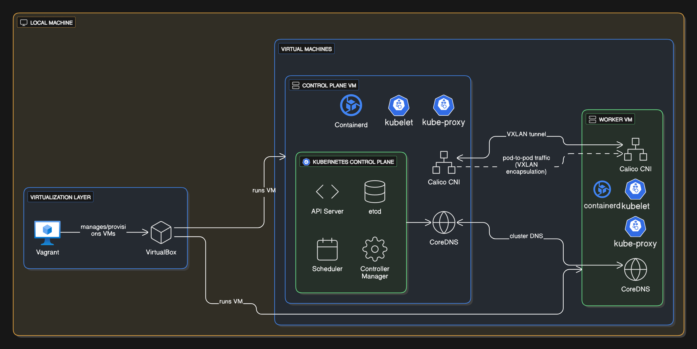

# Deploying a Kubernetes Cluster on Bare Metal

This project provisions a **multi-node Kubernetes cluster** on local VMs using **Vagrant + kubeadm** with networking configured via **Calico (VXLAN mode)** and external service exposure handled by **MetalLB** (L2 mode) for end-to-end app access.

## Tech Stack

- Vagrant + VirtualBox
- Ubuntu 22.04
- kubeadm
- Calico CNI (VXLAN)
- Containerd
- MetalLB
- Ingress Nginx Controller

## Project Implementation

- 1 Control plane node
- 1 Worker node
- MetalLB & Ingress nginx controller Intergation
- Calico CNI with VXLAN backend
- Network Troubleshooting
- Correct DNS and pod-to-pod networking across nodes
- Basic connectivity tests
- Cluster Snapshot & Restore

## Docs

- See [setup.md](docs/setup.md) for more details on architecture
- See [troubleshooting.md](docs/troubleshooting.md) for issues encountered along the way
- See [networking-flow.md](docs/networking-flow.md) for more details on networking
- See [restore-snapshot.md](docs/restore-snapshot.md) for cluster snapshot and restoration procedure
- See [MetalLB.md](docs/MetalLB.md) for MetalLB integration and demonstration with an application deployed in kubernetes
