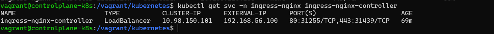
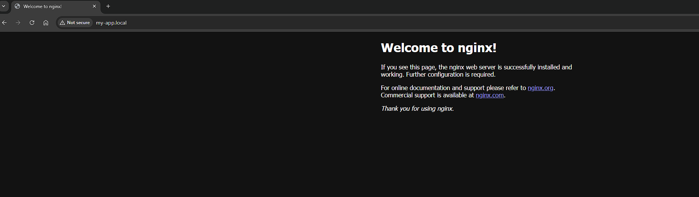

# MetalLB

- MetalLB is a load balancer for bare-metal clusters.
- Allocates a real IP from a pre-defined IP range on the vagrant network
- Uses IPAddressPool to define IP range for resource allocation
- Exposes applications on the defined IP address and forwards traffic, regardless of NodePort, Node and NodeIP

## Procedure

- Deployed MetalLB (see [MetalLB.yaml](../kubernetes/MetalLB.yaml))
- Created the IP pool and provided 11 IP addresses to MetalLB in the range 192.168.56.100-192.168.56.110 (see [IPPool](../kubernetes/metallb-config.yaml))
- MetalLB uses L2Advertisiment to broadcast the assigned IPs at Layer 2 (Address Resolution Protocol) so that other devices on the LAN can reach the services exposed via those IPs.
- Updated ingress-nginx-controller service to type LoadBalancer. LoadBalancer type servies are the only services that ask for External IP.
- Added the below line to the hosts OS

```bash
192.168.56.100 my-app.local
```

- The above hostname mapping will work on local computers. For production environments a domain needs to be registered (e.g myapp.com) and an A record needs to be added to DNS settings to map hostname to MetalLB IP, which will work globally

```bash
myapp.com -> 192.168.56.100
```

- Once the ingress-nginx-controller service is changed to LoadBalancer an external-ip is assigned.
- This IP is owned by MetalLB (as defined in the IPPool range)



- Nginx app deployment is deployed on default namespace along with a kubernetes service bound to port 80 (see [nginx-deployment](../kubernetes/nginx-deployment.yaml))
- An ingress resource is deployed that routes the hostname to the kubernetes service on port 80 (see [ingress](../kubernetes/ingress.yaml))

## End-to-End Traffic Flow

### Step 1

- End-user searches http://my-app.local
- Local /etc/hosts maps my-app.local -> 192.168.56.100 (IP owned by MetalLB)

### Step 2

- Request goes to 192.168.56.100
- This IP is owned by MetalLB and bound to ingress controller's load balancer service
- MetalLB sees traffic to 192.168.56.100 and sends it to the ingress controller service which forwards to actual ingress controller pod

### Step 3

- Ingress controller processes request and checks hostname and path (my.app-local)
- It matches to an ingress resource rule that points to the nginx service on default namespace

### Step 4

- Ingress controller proxies the request internally to the kubernetes service in the default namespace which forwards to the correct pod (nginx-deployment)

### Step 5

- Pod responds and response travels back to end-user
- Nginx-deployment -> nginx-app-service -> ingress controlelr -> MetalLB IP -> local browser



> Nginx-app accessed from local browser
