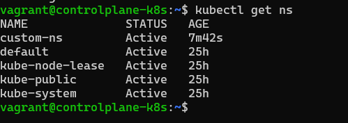

# Restore cluster from snapshot

## Demonstration

- Creates a namespace
- Takes a snapshot of the cluster's state
- Deletes namespace
- Stops kubelet to prevent inconsistencies
- Moves curent data directory content to a backup location
- Restores cluster from snapshot
- Starts kubelet

After rebooting the node, the namespace is back: cluster state successfuly restored

