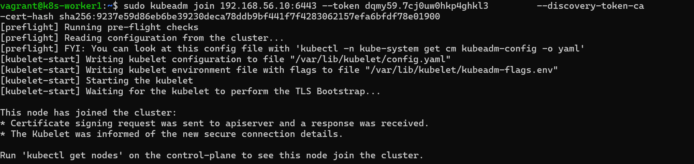
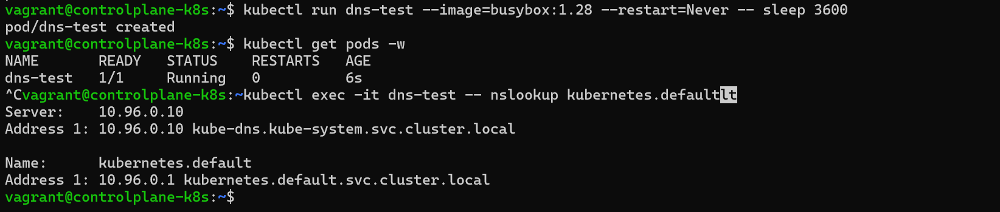

# Cluster Setup Guide

## Vagrant VMs

- Two VMs are spinned up using a Vagrantfile
- An IP address and hostname is assigned to each VM
  - controlplane-k8s (192.168.56.10)
  - k8s-worker1 (192.168.56.11)
- Each VM runs a corresponding bootstrap script depending on hostname:
  - Control plane node → controlplane-bootstrap.sh
  - Worker node → worker-bootstrap.sh
  - Both nodes share common-bootstrap.sh

## common-bootstrap.sh

- Runs on both nodes
- Installs required dependencies: containerd, kubeadm, kubelet, kubectl
- Disables swap (Kubernetes requirement)
- Enables important networking settings (IP forwarding, bridge settings)
- Sets up the container runtime (containerd)

## controlplane-bootstrap.sh

- Runs only on the control plane node
- Initializes the Kubernetes control plane using kubeadm init
- Sets up kubeconfig for the current user
- Manually sets the correct node IP to private network interface to avoid Vagrant’s default NAT IP issue
- Deploys the Calico CNI plugin for pod networking
- Calico CNI creates a network overlay (virtual network) that connects all pods with unique IPs and handles pod-to-pod communication, routing and isolation
- Configures Calico to use VXLAN mode (instead of IPIP) for better compatibility with VirtualBox

## workker-bootstrap.sh

- Runs only on the worker node
- Loads the shared setup from common-bootstrap.sh

## Worker Join

Once the control plane node finishes intializing (kubeadm init), k8s-worker1 VM can be joined to the kubernetes cluster as a worker node using the kubeadm join command and the generated token.



## Test DNS

Run a temporary pod and test dns resolution inside the cluster

```bash
kubectl run dns-test --image=busybox:1.28 --restart=Never -- sleep 3600
kubectl exec -it dns-test -- nslookup kubernetes.default
```


