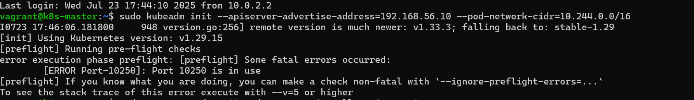
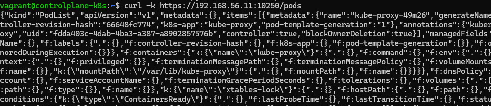
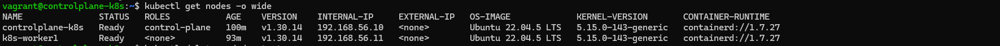

# Troubleshooting

This document outlines problems and solutions during the deployment process

## Kubelet Port 10250 in use

Simple issue where kubeadm initialization was failing as port 10250 was already bound to kubelet service

```bash
netstat -tulnp | grep 10250
```

> To see which service is bound to port 10250

```bash
sudo systemctl stop kubelet
```

> To unbound



## Unable to kubectl exec

A test pod was being deployed in order to execute into it and verify DNS resolution by the below command:

```bash
kubectl exec -it dns-test -- nslookup kubernetes.default
```

However received this error message:
**error: unable to upgrade connection: pod does not exist**

The pod was scheduled on worker node, but both nodes had the same IP assigned to them, therefore kubectl command was trying to contact an incorect node:


This is due to the default NAT IP being used (interface enp0s3) and not the Private VLAN interface (enp0s8) that Kubernetes cluster uses for internal communication

Then queried the Kubelet's read-only API on the worker node to view its running pods, using the private interface IP

```bash
curl -k https://192.168.56.11:10250/pods
```



### To fix:

Set the --node-ip flag in the kubelet config to use the correct enp0s8 interface (private internal network) so that kubelet on each node can advertise the real node IP address:

```bash
NODE_IP=$(ip -4 addr show enp0s8 | grep -oP '(?<=inet\s)\d+(\.\d+){3}' | head -n 1)
```



## IP tunneling failures with Calico

- Calico is a Network Plugin for Kubernetes
- Handles pod networking and gives each pod a unique IP
- Calico pods were crashing due to readiness and liveness probes not being able to verify IPIP tunneling method

### Tunneling: IPIP and VXLan

- Network traffic is sent through tunneling. It wraps the original packet in an outer layer (another packet) so it can travel safely across networks
- IPIP and VXLan and tunneling methods
- IPIP wraps IP inside IP, e.g Pod IP inside Node IP layer
- IPIP is not compatible with Vagrant and VMs
- VXLan wraps IP inside UDP
- UDP is a transmittion protocol that sends data packets fast and is a different outer layer wrap that is easier to ship through most networks and works better in VMs
- The receiving node will unwrap the VXLan packet and deliver it to the pod
- VXLan does not require special kernel features

### To fix:

- Patch the Calico default IPPool to enable VXLAN instead of IPIP
- IPPool is a Kubernetes CRD that defines the IP allocation range (CIDR) that Calico will use to assign IPs to pods
- CIDR is /16 which gives around 65K IP addresses to be assigned
- Disable liveness and readiness probes to avoid crashes due to IPIP

```yaml
cat <<EOF | kubectl apply -f -
apiVersion: crd.projectcalico.org/v1
kind: IPPool
metadata:
  name: default-ipv4-ippool
spec:
  cidr: 10.244.0.0/16
  ipipMode: Never
  vxlanMode: Always
  natOutgoing: true
  disabled: false
EOF

kubectl -n kube-system patch daemonset calico-node --type merge -p '
spec:
  template:
    spec:
      containers:
      - name: calico-node
        env:
        - name: CALICO_IPV4POOL_IPIP
          value: "Never"
        - name: CALICO_IPV4POOL_VXLAN
          value: "Always"
        readinessProbe: null
        livenessProbe: null
'


kubectl -n kube-system patch deployment calico-kube-controllers --type merge -p '
spec:
  template:
    spec:
      containers:
      - name: calico-kube-controllers
        env:
        - name: CALICO_IPV4POOL_IPIP
          value: "Never"
        - name: CALICO_IPV4POOL_VXLAN
          value: "Always"
        readinessProbe: null
        livenessProbe: null
'

```
